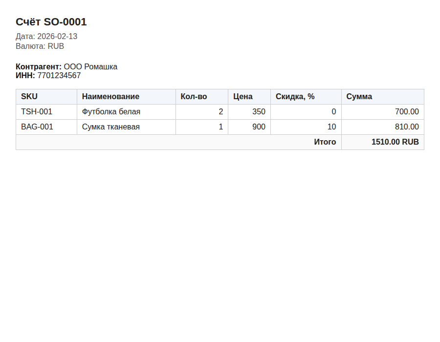

# Тестовое задание — Аналитик автоматизации БП / БД

Implementation of the three-task test assignment attached to
[issue #352](https://github.com/MixaByk1996/groupbuy-bot/issues/352).

> **TL;DR** — three deliverables: a normalized product catalog
> (Task 1), four SQL data-quality checks (Task 2), and a Python
> transform that produces both a filled workbook and a print-ready
> HTML invoice (Task 3). Everything is reproducible with `python
> task<N>_*.py`. All 19 unit tests pass (`pytest tests/`).

## Layout

```
test_assignment/
├── README.md                                  # this file
├── NOTES.md                                   # assumptions / what was/wasn't done
├── templates/                                 # original task templates (unchanged)
│   ├── 01_Task1_Catalog_Normalization.xls
│   ├── 02_Task2_SQL_Checks_Template.xls
│   ├── 03_Task3_Order_Print_Template.xls
│   └── Tasks_instructions.docx
├── task1_normalize.py                         # Task 1 — code
├── 01_Task1_Catalog_Normalization.xlsx        # Task 1 — filled MASTER + ISSUES
├── task2_sql_checks.sql                       # Task 2 — code (single source of truth)
├── task2_build_xlsx.py                        # builder that embeds the SQL in ANSWERS
├── 02_Task2_SQL_Checks_Template.xlsx          # Task 2 — filled ANSWERS
├── task3_transform_and_print.py               # Task 3 — code
├── 03_Task3_Order_Print_Template.xlsx         # Task 3 — filled OUTPUT
├── invoice.html                               # Task 3 — print-ready HTML
├── docs/screenshots/invoice.png               # rendered invoice (for review)
└── tests/                                     # 19 unit tests covering all 3 tasks
```

## How to reproduce

```bash
cd test_assignment

# (one-time) install dependency
pip install openpyxl

# Task 1
python task1_normalize.py

# Task 2 (rebuild xlsx from the SQL file)
python task2_build_xlsx.py

# Task 3
python task3_transform_and_print.py

# Run the tests
pytest tests/ -v
```

## Task 1 — Catalog normalization

`task1_normalize.py` reads `INPUT_products` from
`templates/01_Task1_Catalog_Normalization.xls`, applies the rules below,
and writes the filled `MASTER` + `ISSUES` sheets to
`01_Task1_Catalog_Normalization.xlsx`.

| Rule | Description |
|------|-------------|
| `sku_norm` | `UPPER` + strip spaces/hyphens (`TSH-001` → `TSH001`) |
| `name_norm` | `trim` + collapse double spaces |
| `color_norm` | look up `COLOR_MAP` (case-insensitive fallback); unknown → empty |
| `photo_url_best` | first non-empty URL across duplicates |
| `issues_flag` | `OK` / `DUPLICATE` / `MISSING_ATTR` |

Resulting `MASTER`:

| sku_norm | name_norm | color_norm | photo_url_best | issues_flag |
|----------|-----------|------------|----------------|-------------|
| `BAG001` | Сумка тканевая | `BLACK` | `https://img/2.jpg` | `DUPLICATE` |
| `TSH001` | Футболка белая | `WHITE` | `https://img/1.jpg` | `DUPLICATE` |

## Task 2 — SQL data-quality checks (PostgreSQL)

The four queries live in `task2_sql_checks.sql` (the single source of
truth) and are embedded into the `ANSWERS` sheet by
`task2_build_xlsx.py`.

1. Orders without any `order_lines`.
2. Orders whose declared `total_amount` disagrees with `SUM(qty*price)`
   by more than 1 (`|delta| > 1`).
3. Orders with `status='paid'` whose summed paid payments are below
   `total_amount`.
4. Currency mismatch: a `paid` payment whose currency differs from the
   order's.

The queries are exercised against an in-memory SQLite fixture in
`tests/test_task2_sql.py` (SQLite shares the relevant syntax) so any
regression breaks the build.

## Task 3 — Python transform + invoice

`task3_transform_and_print.py`:

1. Parses `ORDER_INPUT` (header + lines blocks separated by a blank row).
2. Computes `line_total = qty * price * (1 - discount_pct/100)` using
   `Decimal` + `ROUND_HALF_UP` (two decimals).
3. Writes the `OUTPUT` sheet with three blocks
   (`partner` / `sale_order` / `sale_order_lines`) plus a `TOTAL` row.
4. Renders `invoice.html` with the header, line table, and total — all
   user-supplied text is HTML-escaped.

Rendered invoice:



## Tests

```
$ pytest tests/ -v
...
19 passed
```

Coverage:

- `tests/test_task1_normalize.py` — normalization rules and consolidation (7 tests).
- `tests/test_task2_sql.py` — runs all 4 SQL queries against seeded data (5 tests).
- `tests/test_task3.py` — line/total math, HTML content, XSS escaping (7 tests).
